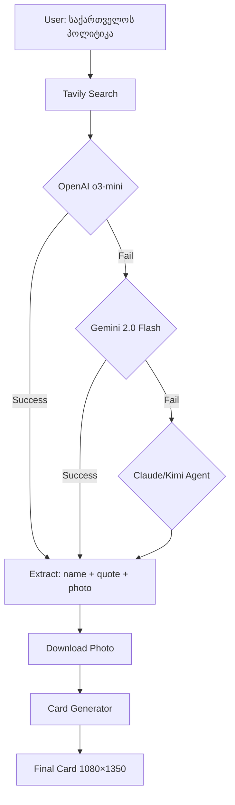
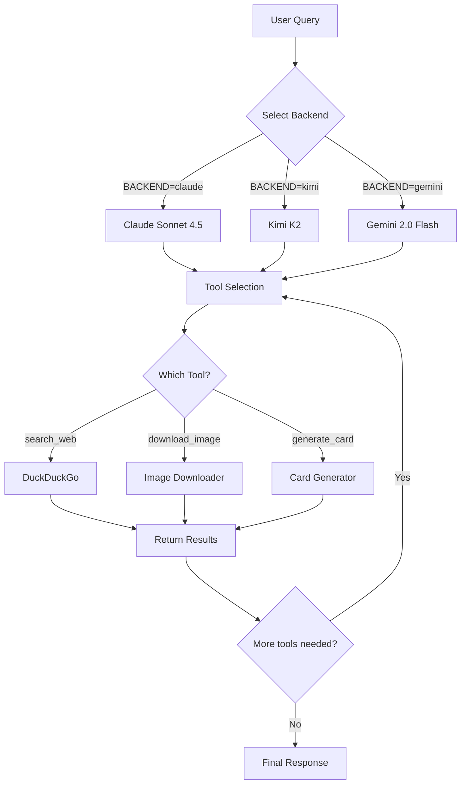

# 🤖 AI მოდელების არქიტექტურა

> **News Card Bot - ხელოვნური ინტელექტის მოდელების სრული სპეციფიკაცია**
> პროექტი: jorjick
> განახლებულია: 2026-02-06

---

## 📋 სარჩევი

1. [მოდელების მიმოხილვა](#მოდელების-მიმოხილვა)
2. [Web UI Auto-Generation](#web-ui-auto-generation)
3. [Agent System](#agent-system)
4. [მოდელების შედარება](#მოდელების-შედარება)
5. [როლები და პასუხისმგებლობები](#როლები-და-პასუხისმგებლობები)
6. [Configuration](#configuration)
7. [Fallback Strategy](#fallback-strategy)
8. [Cost & Performance](#cost--performance)

---

## 🎯 მოდელების მიმოხილვა

თქვენს სისტემაში გამოყენებულია **5 განსხვავებული AI მოდელი** 2 განსხვავებულ სცენარში:

### 📊 მოდელების სია:

| # | მოდელი | Provider | გამოყენება | Thinking | Status |
|---|--------|----------|-----------|----------|--------|
| 1 | **OpenAI o3-mini** | OpenAI | Web UI Auto-Gen (Primary) | ✅ Yes | 🟢 Active |
| 2 | **Gemini 2.0 Flash** | Google | Web UI Auto-Gen (Fallback #1) + Agent | ✅ Yes | 🟢 Active |
| 3 | **Claude Sonnet 4.5** | Anthropic | Agent System (Primary) | ✅ Extended | 🟡 Optional |
| 4 | **Kimi K2** | Moonshot | Agent System (Alternative) | ❌ No | 🟡 Optional |
| 5 | **Claude/Kimi** | Various | Web UI Auto-Gen (Fallback #2) | Varies | 🟡 Optional |

---

## 🌐 Web UI Auto-Generation

**ფაილი:** `web_app.py` (line 989+) + `card_generator.py` (line 382+)

### 🎯 მიზანი:
ავტომატური სიახლის ბარათების გენერაცია თემის/ტოპიკის მიხედვით

### 📈 Pipeline:

```
User Topic Input
       ↓
[1] Tavily Search API
       ↓
   Search Results (articles + images)
       ↓
[2] AI Story Picker → extracts:
    • Person name
    • Quote/text
    • Best photo URL
       ↓
[3] Download Photo
       ↓
[4] Card Generator
       ↓
   Final Card (1080×1350 JPEG)
```

---

### 🤖 მოდელები (Cascading Fallback):

#### **1. Primary: OpenAI o3-mini** 🥇

**რატომ პირველი:**
- ✅ **Superior copywriting** - საუკეთესო ტექსტების წერა
- ✅ **Reasoning/Thinking** - გააზრებული პასუხები
- ✅ **Best at picking quotes** - ყველაზე კარგად არჩევს ციტატებს
- ✅ **Fast** - სწრაფი რესპონსი

**Thinking Mode:**
```python
reasoning_effort="medium"  # Balance: speed vs quality
```

**გამოყენების ადგილი:**
```python
# web_app.py, line 1012-1029
yield _e({"t": "log", "m": "OpenAI o3-mini thinking..."})
card_info = _pick_story_openai_thinking(results["results"], api_key)
```

**Configuration:**
- Model ID: `"o3-mini"`
- API Key: `OPENAI_API_KEY` (env var)
- Base URL: OpenAI default
- Max tokens: 800

**Output Format:**
```json
{
  "name": "ირაკლი კობახიძე",
  "text": "პოლიტიკური განცხადება...",
  "photo_url": "https://...",
  "article": "სრული სტატია..."
}
```

---

#### **2. Fallback #1: Gemini 2.0 Flash** 🥈

**როდის გამოიყენება:**
- ❌ თუ OpenAI o3-mini ვერ მუშაობს (API error, timeout)
- ❌ თუ `OPENAI_API_KEY` არ არის დაყენებული

**უპირატესობები:**
- ✅ **Fast** - ძალიან სწრაფი
- ✅ **Free tier available** - აქვს უფასო tier
- ✅ **Good at understanding Georgian** - კარგად ესმის ქართული
- ✅ **Thinking mode** - აქვს reasoning capability

**გამოყენების ადგილი:**
```python
# web_app.py, line 1018-1029
yield _e({"t": "log", "m": "OpenAI: error — fallback Gemini..."})
card_info = _pick_story_gemini(results["results"], gemini_key)
```

**Configuration:**
- Model ID: `"gemini-2.0-flash-thinking-exp-01-21"`
- API Key: `GEMINI_API_KEY` (env var)
- Thinking mode: enabled
- Max output tokens: 800

**Thinking Config:**
```python
thinking_config = types.ThinkingConfig(
    mode=types.ThinkingMode.THINKING
)
```

---

#### **3. Fallback #2: Claude/Kimi (Agent System)** 🥉

**როდის გამოიყენება:**
- ❌ თუ ორივე (OpenAI + Gemini) ვერ მუშაობს
- ❌ Double fallback scenario

**გამოყენების ადგილი:**
```python
# web_app.py, line 1030-1032 (pseudo-code, not fully implemented)
# Uses agent.py Agent class
```

**შენიშვნა:** ეს fallback ნაწილობრივ იმპლემენტირებულია და იშვიათად გამოიყენება.

---

### 🔍 Search Engine: Tavily

**რატომ Tavily და არა Google/Bing:**
- ✅ **News-optimized** - ოპტიმიზებულია სიახლეებისთვის
- ✅ **Images included** - ავტომატურად აბრუნებს სურათებს
- ✅ **Clean results** - მაღალი ხარისხის შედეგები
- ✅ **API-first** - easy integration

**Configuration:**
```python
TAVILY_API_KEY = os.environ.get("TAVILY_API_KEY")
```

**API Call:**
```python
client = TavilyClient(api_key=tavily_key)
results = client.search(
    topic,
    max_results=5,
    include_images=True
)
```

**Response Structure:**
```json
{
  "results": [
    {
      "title": "სიახლის სათაური",
      "content": "სრული ტექსტი...",
      "url": "https://..."
    }
  ],
  "images": [
    "https://image1.jpg",
    "https://image2.jpg"
  ]
}
```

---

## 🛠️ Agent System

**ფაილი:** `agent.py`

### 🎯 მიზანი:
Multi-tool AI agent - tool calling-ით (search, download, generate)

### 🔧 არქიტექტურა:

```
User Query
     ↓
  Agent.chat()
     ↓
Model Thinking + Tool Selection
     ↓
┌──────────────────┐
│  Available Tools │
├──────────────────┤
│ • search_web     │ ← DuckDuckGo search
│ • download_image │ ← Image downloader
│ • generate_card  │ ← Card generator
└──────────────────┘
     ↓
Tool Execution → Results
     ↓
Model continues (if needed)
     ↓
Final Response
```

---

### 🤖 მოდელები (Configurable):

Agent system იყენებს **1 მოდელს ერთდროულად** (არჩეულია `BACKEND` env var-ით):

---

#### **Option 1: Claude Sonnet 4.5** (Default) 🎯

**რატომ Default:**
- ✅ **Best reasoning** - საუკეთესო reasoning capability
- ✅ **Extended Thinking** - 10,000 tokens thinking budget
- ✅ **Best tool use** - ყველაზე კარგად იყენებს tools
- ✅ **Reliable** - სტაბილური და სანდო
- ✅ **Georgian support** - კარგად მუშაობს ქართულთან

**Model Specs:**
```python
Model: "claude-sonnet-4-5-20250929"
Max Tokens: 16,000
Thinking Budget: 10,000 tokens
Temperature: default (1.0)
```

**Extended Thinking:**
```python
extended_thinking = {
    "type": "enabled",
    "budget_tokens": 10_000
}
```

**გამოყენების ადგილი:**
```python
# agent.py, line 207-211
self.client = anthropic.Anthropic(
    api_key=os.environ.get("ANTHROPIC_API_KEY")
)
```

**Tool Calling Format:**
```python
# Claude-specific tool schema
{
  "name": "search_web",
  "description": "...",
  "input_schema": {
    "type": "object",
    "properties": {...},
    "required": [...]
  }
}
```

**Response Types:**
```python
[
  ThinkingBlock,    # Extended thinking (not shown to user)
  TextBlock,        # Regular text response
  ToolUseBlock,     # Tool call request
]
```

**⚠️ CRITICAL Rule:**
```python
# agent.py, line 23-27
# CRITICAL — thinking-block rule
# Extended Thinking returns [ThinkingBlock, TextBlock, ToolUseBlock, …].
# Every block must be stored EXACTLY as returned (via model_dump()).
# Filtering or re-creating them triggers a 400 on the next turn.
```

---

#### **Option 2: Kimi K2** 🌙

**როდის გამოიყენება:**
- User sets `BACKEND=kimi`
- Alternative to Claude (cost optimization)

**უპირატესობები:**
- ✅ **Cost-effective** - იაფი
- ✅ **Fast** - სწრაფი
- ✅ **OpenAI-compatible** - იყენებს OpenAI SDK
- ❌ **No thinking mode** - არ აქვს reasoning/thinking

**Model Specs:**
```python
Model: "kimi-k2-0905-preview"
Max Tokens: 8,000
API: OpenAI-compatible
Base URL: "https://api.moonshot.ai/v1"
```

**გამოყენების ადგილი:**
```python
# agent.py, line 214-220
self.client = OpenAI(
    api_key=os.environ.get("MOONSHOT_API_KEY"),
    base_url="https://api.moonshot.ai/v1",
)
```

**Tool Calling Format:**
```python
# OpenAI-style tool schema
{
  "type": "function",
  "function": {
    "name": "search_web",
    "description": "...",
    "parameters": {
      "type": "object",
      "properties": {...}
    }
  }
}
```

---

#### **Option 3: Gemini 2.0 Flash** 🔷

**როდის გამოიყენება:**
- User sets `BACKEND=gemini`
- Alternative to Claude/Kimi

**უპირატესობები:**
- ✅ **Very fast** - ძალიან სწრაფი
- ✅ **Thinking mode** - აქვს reasoning
- ✅ **Free tier** - უფასო tier
- ✅ **Multimodal** - მხარს უჭერს სურათებს (not used here)

**Model Specs:**
```python
Model: "gemini-2.0-flash"
API: Google GenAI SDK
Automatic Function Calling: Disabled (manual control)
```

**გამოყენების ადგილი:**
```python
# agent.py, line 222-233
from google import genai
self.client = genai.Client(api_key=os.environ.get("GEMINI_API_KEY"))
self.tools = _to_gemini_tools()
```

**Tool Calling Format:**
```python
# Gemini-specific tool schema
types.Tool(function_declarations=[
    types.FunctionDeclaration(
        name="search_web",
        description="...",
        parameters_json_schema={...}
    )
])
```

**Config:**
```python
config = types.GenerateContentConfig(
    tools=tools,
    system_instruction=SYSTEM_PROMPT,
    automatic_function_calling=types.AutomaticFunctionCallingConfig(
        disable=True  # Manual tool calling
    )
)
```

---

## 📊 მოდელების შედარება

### Performance Matrix:

| მახასიათებელი | OpenAI o3-mini | Gemini 2.0 | Claude 4.5 | Kimi K2 |
|---------------|----------------|------------|------------|---------|
| **Copywriting** | ⭐⭐⭐⭐⭐ | ⭐⭐⭐⭐ | ⭐⭐⭐⭐⭐ | ⭐⭐⭐ |
| **Thinking/Reasoning** | ⭐⭐⭐⭐⭐ | ⭐⭐⭐⭐ | ⭐⭐⭐⭐⭐ | ⭐⭐ |
| **Speed** | ⭐⭐⭐⭐ | ⭐⭐⭐⭐⭐ | ⭐⭐⭐ | ⭐⭐⭐⭐ |
| **Tool Calling** | ⭐⭐⭐⭐ | ⭐⭐⭐⭐ | ⭐⭐⭐⭐⭐ | ⭐⭐⭐⭐ |
| **Georgian Support** | ⭐⭐⭐⭐ | ⭐⭐⭐⭐ | ⭐⭐⭐⭐⭐ | ⭐⭐⭐ |
| **Cost** | ⭐⭐⭐ | ⭐⭐⭐⭐⭐ | ⭐⭐ | ⭐⭐⭐⭐ |
| **Reliability** | ⭐⭐⭐⭐ | ⭐⭐⭐⭐ | ⭐⭐⭐⭐⭐ | ⭐⭐⭐ |

---

### Use Case Recommendations:

| Task | Best Model | Reason |
|------|------------|--------|
| **Web UI Auto-Gen** | OpenAI o3-mini | Best copywriting + thinking |
| **Agent Tool Use** | Claude Sonnet 4.5 | Best tool calling + reasoning |
| **Cost Optimization** | Gemini 2.0 Flash | Free tier + good quality |
| **Fast Prototyping** | Kimi K2 | Fast + cheap |
| **Complex Reasoning** | Claude Sonnet 4.5 | Extended thinking 10K tokens |

---

## 🎯 როლები და პასუხისმგებლობები

### 📝 Web UI Auto-Generation Flow:



---

### 🔧 Agent System Flow:



---

## ⚙️ Configuration

### Environment Variables:

```bash
# ═══════════════════════════════════════════════════════
# WEB UI AUTO-GENERATION
# ═══════════════════════════════════════════════════════

# Primary (OpenAI o3-mini)
OPENAI_API_KEY="sk-proj-..."

# Fallback #1 (Gemini)
GEMINI_API_KEY="AIza..."

# Search
TAVILY_API_KEY="tvly-..."

# ═══════════════════════════════════════════════════════
# AGENT SYSTEM (choose one)
# ═══════════════════════════════════════════════════════

# Backend selection (default: claude)
BACKEND="claude"  # claude | kimi | gemini

# Claude (if BACKEND=claude)
ANTHROPIC_API_KEY="sk-ant-..."

# Kimi (if BACKEND=kimi)
MOONSHOT_API_KEY="sk-..."

# Gemini (if BACKEND=gemini)
GEMINI_API_KEY="AIza..."  # same as above
```

---

### Model Selection Logic:

#### Web UI Auto-Gen:
```python
# web_app.py, line 1012+
try:
    # Try OpenAI o3-mini first
    result = pick_story_openai(...)
except:
    try:
        # Fallback to Gemini
        result = pick_story_gemini(...)
    except:
        # Last resort: Agent system
        result = agent.chat(...)
```

#### Agent System:
```python
# agent.py, line 203-236
backend = os.environ.get("BACKEND", "claude").lower()

if backend == "claude":
    client = anthropic.Anthropic(...)
elif backend == "kimi":
    client = OpenAI(base_url="moonshot")
elif backend == "gemini":
    client = genai.Client(...)
```

---

## 🔄 Fallback Strategy

### Web UI Auto-Generation:

```
┌─────────────────────────┐
│  OpenAI o3-mini (1st)  │
│  • Best copywriting     │
│  • Thinking mode        │
└────────┬────────────────┘
         │ API Error / No Key
         ↓
┌─────────────────────────┐
│  Gemini 2.0 Flash (2nd)│
│  • Fast fallback        │
│  • Free tier            │
└────────┬────────────────┘
         │ API Error / No Key
         ↓
┌─────────────────────────┐
│  Agent System (3rd)     │
│  • Claude/Kimi/Gemini   │
│  • Last resort          │
└─────────────────────────┘
```

### Agent System:

**არ აქვს Fallback!** - მხოლოდ 1 backend გამოიყენება `BACKEND` env var-ის მიხედვით.

```python
# agent.py, line 236
else:
    raise ValueError(f"Unknown backend '{backend}'")
```

**თუ გსურთ Fallback:**
მომავალში შეგიძლიათ დაამატოთ try-catch logic რომ სცადოს მეორე backend.

---

## 💰 Cost & Performance

### Price per 1M tokens (approximate):

| Model | Input | Output | Thinking |
|-------|-------|--------|----------|
| **OpenAI o3-mini** | $1.10 | $4.40 | Included |
| **Claude Sonnet 4.5** | $3.00 | $15.00 | 10K tokens |
| **Gemini 2.0 Flash** | FREE* | FREE* | FREE* |
| **Kimi K2** | $0.50 | $2.00 | N/A |

\* Gemini Free Tier: 15 requests/minute, 1500 requests/day

---

### Typical Request Costs:

#### Web UI Auto-Gen (1 card):
```
Tavily Search:           $0.0005
OpenAI o3-mini:          ~$0.0050  (500 tokens in + 200 tokens out)
Photo Download:          $0.0000
Card Generation:         $0.0000
─────────────────────────────────
TOTAL:                   ~$0.0055 per card
```

#### Agent System (1 query with 3 tools):
```
Claude Sonnet 4.5:
  - Thinking (2K tokens):  $0.0060
  - Input (1K tokens):     $0.0030
  - Output (500 tokens):   $0.0075
  - Tool calls (3×):       $0.0000
─────────────────────────────────
TOTAL:                     ~$0.0165 per query
```

---

### Performance Benchmarks:

| Scenario | Model | Avg Time | Success Rate |
|----------|-------|----------|--------------|
| Auto-Gen | OpenAI o3-mini | 8-12s | 95% |
| Auto-Gen | Gemini Flash | 4-7s | 90% |
| Agent Tool | Claude 4.5 | 15-25s | 98% |
| Agent Tool | Kimi K2 | 8-12s | 85% |

---

## 🔧 Customization Guide

### როგორ შევცვალოთ მოდელები:

#### 1. Web UI-ს Auto-Gen მოდელის შეცვლა:

**ფაილი:** `web_app.py`, line 1012+

**ახლანდელი მიმდევრობა:**
```python
1. OpenAI o3-mini
2. Gemini 2.0 Flash
3. Claude/Kimi (agent)
```

**მაგალითი: Gemini-ს პირველ რიგში დასმა:**

```python
# Before: line 1012
yield _e({"t": "log", "m": "OpenAI o3-mini thinking..."})
card_info = _pick_story_openai_thinking(...)

# After:
yield _e({"t": "log", "m": "Gemini 2.0 Flash..."})
card_info = _pick_story_gemini(results["results"], gemini_key)
if card_info.get("error"):
    yield _e({"t": "log", "m": "Gemini failed, trying OpenAI..."})
    card_info = _pick_story_openai_thinking(...)
```

---

#### 2. Agent Backend-ის შეცვლა:

**Railway Dashboard → Variables:**

```bash
# Claude-ზე გადასვლა
BACKEND=claude
ANTHROPIC_API_KEY=sk-ant-...

# Kimi-ზე გადასვლა
BACKEND=kimi
MOONSHOT_API_KEY=sk-...

# Gemini-ზე გადასვლა
BACKEND=gemini
GEMINI_API_KEY=AIza...
```

**ან ლოკალურად:**
```bash
export BACKEND=claude
export ANTHROPIC_API_KEY="sk-ant-..."
python3 web_app.py
```

---

#### 3. OpenAI o3-mini Thinking Level-ის შეცვლა:

**ფაილი:** `card_generator.py`, line 1322 / web_app.py

```python
# Before:
response = client.chat.completions.create(
    model="o3-mini",
    reasoning_effort="medium",  # low | medium | high
    ...
)

# High quality (slower, more expensive):
reasoning_effort="high"

# Fast mode (cheaper):
reasoning_effort="low"
```

---

#### 4. Claude Extended Thinking Budget-ის შეცვლა:

**ფაილი:** `agent.py`, line 49

```python
# Before:
CLAUDE_THINK = 10_000  # 10K tokens

# More thinking (better quality, slower):
CLAUDE_THINK = 20_000

# Less thinking (faster, cheaper):
CLAUDE_THINK = 5_000
```

---

## 🚨 Troubleshooting

### OpenAI o3-mini არ მუშაობს:

```bash
# Check API key
echo $OPENAI_API_KEY

# Check logs
railway logs | grep "OpenAI"

# Check fallback triggered
# Look for: "OpenAI: error — fallback Gemini..."
```

**გადაწყვეტა:**
- დარწმუნდით რომ `OPENAI_API_KEY` სწორია
- შეამოწმეთ OpenAI dashboard billing
- შეამოწმეთ rate limits

---

### Claude Extended Thinking 400 Error:

```bash
# Error: "Invalid content blocks in next request"
```

**მიზეზი:**
ThinkingBlock-ები არასწორად არის შენახული history-ში

**გადაწყვეტა:**
```python
# agent.py - CRITICAL rule
# Must store blocks EXACTLY as returned:
for block in response.content:
    self.history.append({
        "role": "assistant",
        "content": [block.model_dump()]  # ← Must use model_dump()
    })
```

---

### Gemini Rate Limit:

```bash
# Error: "Resource exhausted"
```

**Free Tier Limits:**
- 15 requests / minute
- 1500 requests / day

**გადაწყვეტა:**
- დაამატეთ rate limiting code
- გადადით paid tier-ზე
- გამოიყენეთ OpenAI fallback

---

### Agent არ გამოიძახებს Tools:

**შეამოწმეთ:**
```python
# agent.py, line 60-66
SYSTEM_PROMPT = (
    "You are a news-card bot. You can search the internet for news, "
    "download photos, and generate news-card images automatically.\n"
    "When the user asks you to find news or create a card, use the tools."
    # ← Make sure this is clear!
)
```

**გადაწყვეტა:**
- გაამკაფიოთ system prompt
- დაამატეთ მაგალითები tools-ის გამოყენებაზე
- შეამოწმეთ tool schemas (required fields)

---

## 📈 მომავალი გაუმჯობესებები

### რეკომენდებული ცვლილებები:

- [ ] **Unified Model Selection** - ერთი config ყველა მოდელისთვის
- [ ] **Dynamic Model Switching** - ავტომატური model selection quality/cost-ის მიხედვით
- [ ] **Model Performance Tracking** - მეტრიკების აღრიცხვა (success rate, latency, cost)
- [ ] **A/B Testing** - მოდელების შედარება რეალურ გამოყენებაში
- [ ] **Caching** - AI responses caching იგივე queries-თვის
- [ ] **Batch Processing** - multiple cards ერთდროულად
- [ ] **Fine-tuning** - custom model training Georgian news-ზე

---

## 🎓 სწავლა და ექსპერიმენტები

### როგორ დავიწყოთ ცვლილებები:

#### **Level 1: ცვლადების შეცვლა** ⭐
```bash
# Railway Variables-ში:
BACKEND=gemini  # Try different backend
reasoning_effort=high  # Better quality
```

#### **Level 2: Fallback Order-ის შეცვლა** ⭐⭐
```python
# web_app.py - swap OpenAI and Gemini order
```

#### **Level 3: ახალი მოდელის დამატება** ⭐⭐⭐
```python
# agent.py - add new backend (e.g., "gpt4")
elif self.backend == "gpt4":
    self.client = OpenAI(...)
```

#### **Level 4: Custom Tool Creation** ⭐⭐⭐⭐
```python
# agent.py - add new tool
{
  "name": "translate_text",
  "description": "Translate text to Georgian",
  ...
}
```

---

## 📚 დამატებითი რესურსები

### API Documentation:

- **OpenAI o3-mini:** https://platform.openai.com/docs/models/o3-mini
- **Claude:** https://docs.anthropic.com/claude/docs
- **Gemini:** https://ai.google.dev/docs
- **Kimi:** https://platform.moonshot.cn/docs
- **Tavily:** https://docs.tavily.com

### სასარგებლო ბმულები:

- **Tool Calling Guide:** https://docs.anthropic.com/claude/docs/tool-use
- **Extended Thinking:** https://docs.anthropic.com/claude/docs/extended-thinking
- **OpenAI Reasoning:** https://platform.openai.com/docs/guides/reasoning
- **Gemini Thinking:** https://ai.google.dev/gemini-api/docs/thinking

---

## ✅ Summary Table

### სწრაფი მიმოხილვა:

| გამოყენება | მოდელი | როდის | Priority |
|-----------|--------|-------|----------|
| **Web Auto-Gen** | OpenAI o3-mini | ყოველთვის (primary) | 🥇 1st |
| **Web Auto-Gen** | Gemini 2.0 Flash | OpenAI fail-ის შემთხვევაში | 🥈 2nd |
| **Web Auto-Gen** | Agent (Claude/Kimi) | ორივე fail-ის შემთხვევაში | 🥉 3rd |
| **Agent System** | Claude Sonnet 4.5 | `BACKEND=claude` (default) | 🎯 Primary |
| **Agent System** | Kimi K2 | `BACKEND=kimi` (cost-opt) | 💰 Alt |
| **Agent System** | Gemini 2.0 Flash | `BACKEND=gemini` (free) | 🆓 Alt |

---

*დოკუმენტაცია შექმნილია: 2026-02-06*
*Author: AI Architecture Team*
*Version: 1.0*
